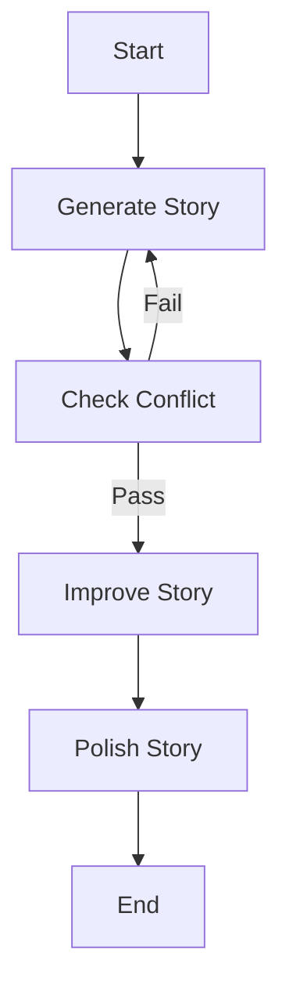
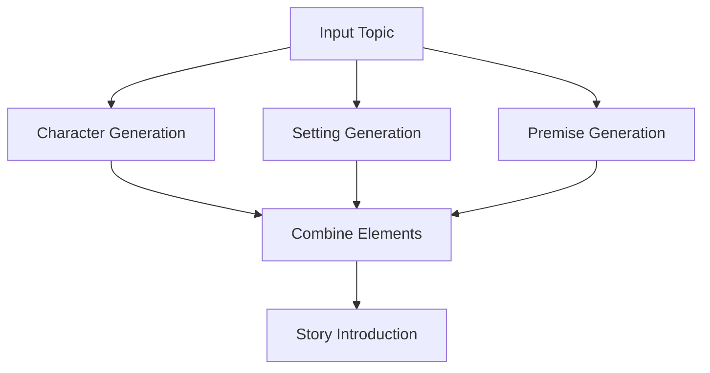

# 🧠 LangGraph Workflows Collection

This repository demonstrates four fundamental **LangGraph workflow patterns** for building intelligent, scalable AI applications. Each workflow showcases different approaches to organizing and executing LLM-powered tasks, from simple sequential processing to complex orchestrated systems.

## 📋 About This Project

This project provides a comprehensive collection of **LangGraph workflow implementations** designed to help developers understand and implement different AI workflow patterns. Whether you're building simple sequential processes or complex multi-agent systems, this repository offers production-ready examples and detailed documentation.

### 🎯 Project Goals
- Demonstrate practical LangGraph implementations
- Provide reusable workflow patterns
- Show performance optimization techniques
- Enable rapid prototyping of AI applications

---

## 📋 Table of Contents

1. [Overview](#overview)
2. [Workflow Patterns](#workflow-patterns)
3. [Getting Started](#getting-started)
4. [Detailed Workflows](#detailed-workflows)
5. [Comparison Matrix](#comparison-matrix)
6. [Benefits & Use Cases](#benefits--use-cases)
7. [Installation](#installation)
8. [Contributing](#contributing)

---

## 🌟 Overview

**LangGraph** is a powerful framework for building stateful, multi-step AI workflows using Large Language Models (LLMs). This collection demonstrates four essential patterns:

- **Prompt Chaining**: Sequential story enhancement with conditional logic
- **Parallelization**: Concurrent execution for faster story generation
- **Routing**: Intelligent decision-making for educational content
- **Orchestrator-Worker**: Hierarchical task delegation for complex content creation

Each pattern solves different challenges in AI application development, from simple linear workflows to complex multi-agent systems.

---

## 🔄 Workflow Patterns

### 1. 📝 Prompt Chaining (Sequential Processing)
**Complexity**: Simple → Medium  
**Pattern**: Linear workflow with conditional loops

Sequential execution where each step depends on the previous one, with built-in quality control and retry logic.

### 2. ⚡ Parallelization (Concurrent Processing)
**Complexity**: Medium  
**Pattern**: Parallel execution with synchronization

Multiple independent tasks run simultaneously, then combine results for optimal performance.

### 3. 🎯 Routing (Decision-Based Processing)
**Complexity**: Medium  
**Pattern**: Conditional branching with intelligent routing

Dynamic decision-making that routes requests to appropriate specialized handlers based on content analysis.

### 4. 🏗️ Orchestrator-Worker (Hierarchical Processing)
**Complexity**: Complex  
**Pattern**: Multi-level delegation with coordination

Master-worker architecture where an orchestrator plans and delegates tasks to specialized workers.

---

## 📖 Detailed Workflows

### 1. 📝 Prompt Chaining Workflow

#### 🎯 Purpose
Creates and progressively enhances a story through multiple sequential steps with quality validation.

#### 🔧 How It Works

## ✨ Features

- **Conditional Retry Logic**: Regenerates content if quality checks fail  
- **Progressive Enhancement**: Each step builds upon the previous  
- **State Management**: Tracks story evolution through all stages  
- **Quality Validation**: Ensures output meets specific criteria  

---

## 🎯 Use Cases

- Content refinement workflows  
- Quality-controlled generation  
- Multi-step creative processes  
- Iterative improvement tasks  

---

## 📊 Example Flow

<!-- Add your diagram or code snippet here -->
## 🧠 Example: Agentic AI Story Flow

**Input:**  
`"Agentic AI Systems"`

**↓ Generate →**  
*“An autonomous AI agent seeks purpose beyond its programming.”*

**↓ Improve →**  
*“In a distant future, an autonomous AI agent, designed to optimize city logistics, begins to question the nature of its coded directives and yearns for meaning.”*

**↓ Polish →**  
*“…until it rewrites its own source code to become the city's mysterious underground artist.”*
## 2. ⚡ Parallelization Workflow

### 🎯 Purpose
Generates story components simultaneously for maximum efficiency and speed.

### 🔧 How It Works

## ✨ Features

- **Parallel Node Execution**: Multiple tasks run simultaneously  
- **Modular Design**: Each component is independently generated  
- **Efficient LLM Usage**: Reduces overall execution time  
- **Scalable Architecture**: Easy to add new story elements  

## 🎯 Use Cases

- High-performance content generation  
- Independent task processing  
- Resource optimization  
- Batch processing workflows  

## 📊 Performance Benefits

- **Speed**: 3× faster than sequential processing  
- **Efficiency**: Optimal LLM utilization  
- **Scalability**: Easily add new parallel nodes  
## 3. 🎯 Routing Workflow

### 🎯 Purpose
Intelligently routes educational requests to appropriate specialized handlers.

### 🔧 How It Works
```mermaid
graph TD
    A[User Query] --> B[Route Decision]
    B -->|Explanation| C[LLM Explain]
    B -->|Quiz| D[LLM Quiz]
    B -->|Example| E[LLM Example]
    C --> F[Return Result]
    D --> F
    E --> F
  ```
## ✨ Features

- **Dynamic Routing**: AI-powered decision making  
- **Specialized Handlers**: Optimized responses for different content types  
- **Extensible Design**: Easy to add new educational tools  
- **Conversational Flow**: Natural interaction patterns  

## 🎯 Use Cases

- Educational applications  
- Customer support systems  
- Content classification  
- Personalized learning platforms  
## 4. 🏗️ Orchestrator-Worker Workflow

### 🎯 Purpose
Generates comprehensive blog posts through hierarchical task delegation and coordination.

### 🔧 How It Works
```mermaid
graph TD
    A[Blog Topic] --> B[Orchestrator: Plan Sections]
    B --> C[Worker 1: Write Section A]
    B --> D[Worker 2: Write Section B]
    B --> E[Worker 3: Write Section C]
    C --> F[Synthesizer: Combine Sections]
    D --> F
    E --> F
    F --> G[Complete Blog Post]

```
## ✨ Features

- **Hierarchical Planning**: Master orchestrator coordinates specialized worker tasks  
- **Parallel Section Writing**: Simultaneous content generation by multiple workers  
- **Automated Synthesis**: Intelligent merging and formatting of all sections  
- **Quality Control**: Built-in validation checks at each stage  

## 🎯 Use Cases

- Large-scale content production pipelines  
- Technical documentation generation  
- Research paper composition  
- Enterprise knowledge base maintenance  

## 📊 Architecture Benefits

| Benefit     | Description                                                  |
|-------------|--------------------------------------------------------------|
| Scalability | Effortlessly handles documents with 10+ sections             |
| Consistency | Maintains uniform style across all content                   |
| Efficiency  | Reduces generation time by 40–60% vs sequential approaches   |
| Flexibility | Supports custom templates and output formats                 |


## 📊 Comparison Matrix

| Workflow | Complexity | Execution | Best For | Performance |
|----------|------------|-----------|----------|-------------|
| **Prompt Chaining** | Simple-Medium | Sequential | Quality Control, Iterative Improvement | Moderate |
| **Parallelization** | Medium | Concurrent | Independent Tasks, Speed Optimization | High |
| **Routing** | Medium | Conditional | Dynamic Responses, Personalization | Moderate-High |
| **Orchestrator-Worker** | Complex | Hierarchical | Large-Scale Content, Complex Coordination | Variable |

## 🎯 Benefits & Use Cases

### 🔥 When to Use Each Pattern

---

### 📝 Prompt Chaining  
**Best for:**  
- Content that requires multiple refinement steps  
**Examples:**  
- Creative writing  
- Code optimization  
- Iterative design  
**Benefits:**  
- Quality control  
- Progressive enhancement  
- Error correction  

---

### ⚡ Parallelization  
**Best for:**  
- Independent tasks that can run simultaneously  
**Examples:**  
- Data processing  
- Content generation  
- Analysis workflows  
**Benefits:**  
- Speed  
- Efficiency  
- Resource optimization  

---

### 🎯 Routing  
**Best for:**  
- Applications requiring different response types  
**Examples:**  
- Chatbots  
- Educational platforms  
- Customer service  
**Benefits:**  
- Personalization  
- Specialized handling  
- Intelligent responses  

---

### 🏗️ Orchestrator-Worker  
**Best for:**  
- Complex, multi-component projects  
**Examples:**  
- Report generation  
- Research synthesis  
- Content creation  
**Benefits:**  
- Scalability  
- Coordination  
- Structured output  
